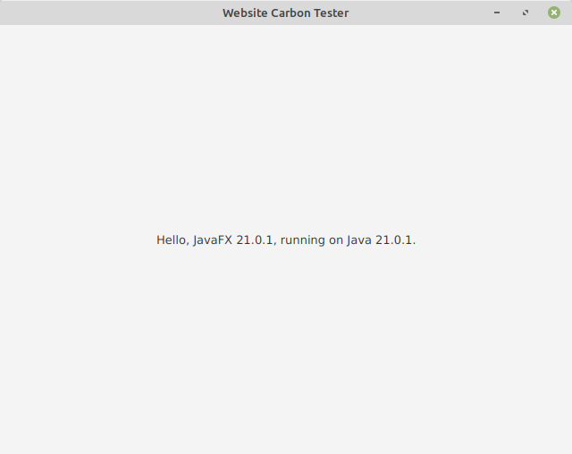
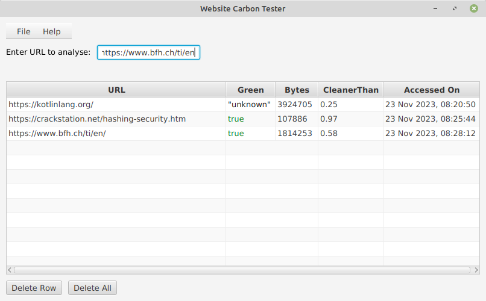

# Website Carbon Tester

## Tasks

The internet consumes a lot of electricity. Every Website has its own carbon footprint.
This project aims to develop a tool to display the carbon footprint of a website. 

You should use the following JSON based API to get the carbon footprint of a website: https://api.websitecarbon.com.

The endpoint: '/site?url={xxx}' requires a URL parameter and will run a test in real time to 
calculate the carbon emissions generated per page view.
A successful response will look like the following. More examples can be found in the directory 'examples'.

```{
  "url": "https://www.bfh.ch/ti/en/",
  "green": true,
  "bytes": 1806548,
  "cleanerThan": 0.58,
  "rating": "C",
  "statistics": {
    "adjustedBytes": 1363943.74,
    "energy": 0.0010289199924096465,
    "co2": {
      "grid": {
        "grams": 0.45478263664506374,
        "litres": 0.2529501025019844
      },
      "renewable": {
        "grams": 0.3942821410913766,
        "litres": 0.21929972687502364
      }
    }
  },
  "timestamp": 1700742472
}
```

Implement a JavaFX/TornadoFX GUI application that allows you to enter URLs and then 
displays at least the following values in a tabular form:
- the url
- if the website is green or not
- the number of bytes transferred during the page load
- cleanerThan: A numeric value between 0 and 1 representing the percentage of websites that are cleaner than this one.
- rating: A string, consumption index similar to electrical appliances (A,A+,B,C,D,E,F) (not described in the API documentation but provided, see the example above) 
- the timestamp of the measurement (as date and time).

It should be possible to add URLs and to remove them again. The table should be updated accordingly. 
Duplicated URLs should not be added, but should replace older ones.
The URLs and their carbon values should be automatically stored in a file and reloaded when the application is started again.

The following requirements must be fulfilled:
- The UI is internationalized with resource bundles (at least 2 languages). The language should be specified at program start. No hot switching of languages is required.
- Your application should separate its view from a data model.
- Correct exception handling and clean code (e.g., no unused code, no TODOs, etc.) is mandatory.
- It is mandatory to build the application with Maven. An example of POM file is in the root of initial project structure.
- It is mandatory to perform at least 10 "git commit/push", not a single one at the very end!
- You are free to choose the global layout of your application. You can use FXML or not, it is as you like.

See a UI example at the end of this document.

## Evaluation Details

Basic Features (15 Points)

- Retrieving live data from the API &rarr; 2 points
- Website carbon values presented as table/list with all the pieces of information &rarr; 2 points
- Adding and removing of URLs to/from the table &rarr; 1 point
- Saving and reloading of the table/list &rarr; 2 points
- Internationalization (at least 2 languages)  &rarr; 2 points
- Correct exception handling &rarr; 1 point
- Separation of view from data model &rarr; 2 points
- Clean code (no severe warnings/errors, no unused code, no TODOs) &rarr; 1 point
- Javadoc/KDoc (public components have useful comments) &rarr; 1 point
- Working Maven build &rarr; 1 point

&rarr; **Minimal Requirements: To pass 12 points must be reached !!!**

## JavaFX/TornadoFX application

A full-fledged, simple JavaFX/TornadoFX application is given. The idea is, that
you substitute and/or enhance the given classes to build your own
application. Below, you'll find information for:

- Importing the sample application into IntelliJ
- Building the sample application with Maven

## Importing the Project into IntelliJ

Git-clone the sample application. Then import the application as a
Maven project ("Import..." -> "Maven" -> "Existing Maven Projects").

To run the sample application, select the Kotlin 
file `HelloFXApp.java`, right-click and
select "Run 'HelloFXAppKt' ".

A window as shown above will be displayed.



## Building the Sample Application with Maven

You are allowed to change the package name(s).
However, it must be possible to build your application at
any time with [Maven](http://maven.apache.org/) by following the steps
given below. It is assumed that you have installed Maven on your
computer.

### Compilation

To compile and build an executable JAR file, open a terminal window and
go to the root directory of this project. Then type:

```shell
$ mvn clean compile package
[a lot of output]
...
[INFO] ------------------------------------------------------------------------
[INFO] BUILD SUCCESS
[INFO] ------------------------------------------------------------------------
[INFO] Total time:  <....>
[INFO] Finished at: <....>
[INFO] ------------------------------------------------------------------------
```

### Execution

To run the (sample) JavaFX/TornadoFX application, type:

```shell
$ mvn javafx:run
[some output]
...
[INFO] ------------------------------------------------------------------------
[INFO] BUILD SUCCESS
[INFO] ------------------------------------------------------------------------
[INFO] Total time:  <....>
[INFO] Finished at: <....>
[INFO] ------------------------------------------------------------------------
```

## UI Example 



